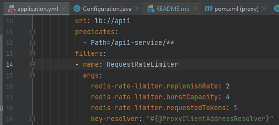

# meli-technical-test

# Implementación API Proxy

Este proyecto se ha elaborado como un reto técnico utilizando diversas tecnologías para construir una arquitectura de microservicios que incluye:

1. **Eureka Server**: Para gestionar y registrar microservicios.
2. **API1**: Un servicio dummy que devuelve un objeto con un mensaje y un ID de instancia.
3. **API2**: Un servicio dummy que devuelve un objeto con un mensaje y un ID de instancia.
4. **Proxy API**: Un API Gateway configurado con filtros para controlar la cantidad de solicitudes entrantes.
5. **Nginx**: Balanceador de carga para redirigir las solicitudes del cliente hacia las instancias del API Proxy registradas en Eureka.

## Requisitos Previos

- **Java 17** o superior
- **Maven 3.6.3** o superior
- **Spring Boot 3.3.2**
- **Nginx** (instalado en la máquina)
- **Redis** (para el límite de tasa en el API Gateway)

## 1. Proyecto Eureka Server

### Descripción
El **Eureka Server** actúa como un servicio de descubrimiento donde todos los microservicios se registran y son detectados por otros servicios.

### Ejecución


## 2. Proyecto api1 y api2

### Descripción
El **Api1 y Api2** actúan como un microservicio dummy basico que expone un servicio Get para devolver un objeto json con un mensaje y un id de instancia.

### Ejecución

Api1


Api2


## 3. Proyecto proxy

### Descripción
Este proyecto configura un **Proxy API** utilizando **Spring Cloud Gateway**. El gateway enruta las solicitudes a servicios backend y aplica filtros para controlar el tráfico. Además, se ha integrado **Spring Boot Actuator** para el monitoreo y registro de métricas.

Para la implementación de los filtros, se hizo uso de los filtros de limite de tasa basados en redis, donde se controlan varios parametros para controlar la cantidad de request recibidos. 
En este apartado se utilizo la interface KeyResolve para definir los valores a limitar como por ejemplo la ip de origen, path, combinación de ambos y header authorization.

### Ejecución

Aqui se configura uno de los filtros que permite limitar las cantidad maxima de 4 request de usuario por segundo.



Para validar, se utilizo Jmeter como herramienta de prueba para realizar 10 peticiones concurrentes en un segundo.


Con el fin de observar las estadisticas del proxy, se incluye la libreria **Spring Boot Actuator**, esta permite exponer una rest api donde podemos visualizar metricas relacionadas al proxy.


## 4. Proyecto statitics-control

### Descripción
El componente **statitics-control** es un servicio que expone una API REST para consultar detalles adicionales sobre las solicitudes de entrada, las respuestas de salida y la duración en milisegundos de las solicitudes recibidas por el proxy

### Ejecución


## 5. Redis

### Descripción
La base de datos en caché Redis se utiliza para aplicar los filtros y para almacenar estadísticas adicionales sobre el comportamiento del proxy.

### Ejecución

Para la ejecución de redis se ejecuto sl siguiente comando docker:

docker run --name redis  -p 6379:6379 -d -e ALLOW_EMPTY_PASSWORD=yes bitnami/redis:latest

## 6. NGINX

### Descripción

**NGINX** se utiliza como balanceador de carga, distribuyendo las solicitudes del cliente entre las instancias del Proxy API.

### Ejecución

1. Instalar Nginx en tu máquina local.
2. Configurar Nginx editando el archivo nginx.conf:

```json
http {
  upstream proxy_api {
  server 127.0.0.1:8080; //Dirección instancia 1 proxy
  server 127.0.0.1:8081; //Dirección instancia 2 proxy
}
server {
  listen 8090;
  location / {
  proxy_pass http://proxy-api;
}
}
}
```

